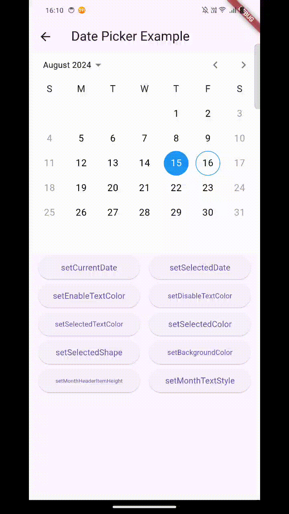
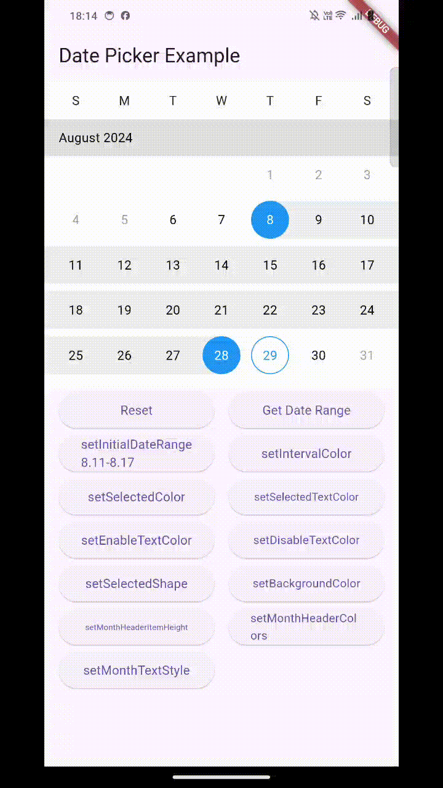

<h1 align="center">date_picker_pro</h1>
<h4 align="center">
  日期选择器，目前提供日期选择(DatePicker)和日期范围选择(DateRangePicker)，未来将提供更多功能，欢迎提建议
</h4>

<h4>
  官方提供的日期选择组件，没办法自定义样式。这个库就是为解决这个问题诞生的，提供样式更改和结果回调。如果需要弹窗选择日期，需要自己使用这个库进行二次封装。
</h4>

<div align="center">
  <a href="https://pub.dev/packages/date_picker_pro">
    
  </a>
  
</div>

<p align="center">
  <a href="#usage">Usage</a> •
  <a href="#issues-and-feedback">Issues and Feedback</a> •
  <a href="#license">License</a>
</p>

> [Feedback welcome](https://github.com/LiuDongCai/date_picker_pro/issues) and [Pull Requests](https://github.com/LiuDongCai/date_picker_pro/pulls) are most welcome!

[**English**](https://github.com/LiuDongCai/date_picker_pro/blob/master/README-ZH.md) | 中文

## Usage

### Import the package

要使用这个库，点击[**pub.dev-date_picker_pro**](https://pub.dev/packages/date_picker_pro).

### DatePicker Use

DatePicker 使用示例如下：

```dart
    import 'package:date_picker_pro/date_picker.dart';

    DatePicker(
        controller: controller,
        initialDate: DateTime(2024, 8, 15),
        currentDate: DateTime(2024, 8, 16),
        firstDate: DateTime(2021, 8, 1),
        lastDate: DateTime(2024, 9, 28),
        selectableDayPredicate: (DateTime date) {
            // Only weekdays (Monday to Friday) are allowed to be selected
            if (date.weekday == DateTime.saturday ||
            date.weekday == DateTime.sunday) {
            return false;
            }
            return true;
        },
        onDateChanged: (DateTime date) {},
        onDisplayedMonthChanged: (DateTime date) {},
        selectedColor: Colors.blue,
        selectedTextColor: Colors.white,
        enableTextColor: Colors.black,
        disableTextColor: Colors.grey,
        selectedShape: BoxShape.circle,
        monthHeaderItemHeight: 40,
        backgroundColor: Colors.white,
        monthTextStyle: const TextStyle(
            color: Colors.black,
            fontSize: 14,
            fontWeight: FontWeight.normal,
        ),
    )
```

| API                                                             | 描述             |
|-----------------------------------------------------------------|----------------|
| controller                                                      | 控制器            |
| initialDate<br/>controller.setSelectedDate()                    | 设置所选日期         |
| currentDate<br/>controller.setCurrentDate()                     | 设置当前日期         |
| firstDate                                                       | 第一个可以选择的日期     |
| lastDate                                                        | 最后一个可以选择的日期    |
| onDisplayedMonthChanged                                         | 所选月份变化回调       |
| selectedColor<br/>controller.setSelectedColor()                 | 选中日期的颜色        |
| selectedTextColor<br/>controller.setSelectedTextColor()         | 选中日期的文本颜色      |
| enableTextColor<br/>controller.setEnableTextColor()             | 可选日期的文本颜色      |
| disableTextColor<br/>controller.setDisableTextColor()           | 不可选日期的文本颜色     |
| selectedShape<br/>controller.setSelectedShape()                 | 选中日期的形状，含矩形、圆形 |
| onDateChanged                                                   | 选中日期回调         |
| monthTextStyle<br/>controller.setMonthTextStyle()               | 设置月的文本样式       |
| selectableDayPredicate                                          | 设置可选日期规则       |
| monthHeaderItemHeight<br/>controller.setMonthHeaderItemHeight() | 设置月的标题高度       |
| backgroundColor<br/>controller.setBackgroundColor()             | 设置背景颜色         |

##### DatePicker Sample([Source Code](/example/lib/date_range_picker_demo.dart))


##### Demo video:
https://github.com/user-attachments/assets/cd3317ac-4cf6-4c99-8b68-a1df5519ac58

### DateRangePicker Use

DateRangePicker 使用示例如下：

```dart
    import 'package:date_picker_pro/date_picker.dart';

    DateRangePicker(
        controller: dateRangePickerController,
        initialDateRange: DateTimeRange(
          start: DateTime(2024,8,1),
          end: DateTime(2024,8,30),
        ),
        currentDate: DateTime.now(),
        firstDate: DateTime(2023),
        lastDate: DateTime(2025),
        intervalColor: Colors.blueGrey.shade50,
        selectedColor: Colors.blue,
        selectedTextColor: Colors.white,
        enableTextColor: Colors.black,
        disableTextColor: Colors.grey,
        selectedShape: BoxShape.rectangle,
        monthHeaderItemHeight: 40,
        monthHeaderColor: Colors.grey.shade300,
        backgroundColor: Colors.white,
        monthTextStyle: const TextStyle(
            color: Colors.black,
            fontSize: 14,
            fontWeight: FontWeight.normal,
        ),
        onDateTimeRangeChanged: (DateTimeRange? dateTimeRange) {},
    )
```

| API                                                             | 描述                    |
|-----------------------------------------------------------------|-----------------------|
| controller                                                      | 控制器                   |
| initialDateRange<br/>controller.setInitialDateRange()           | 初始化所选日期范围             |
| currentDate<br/>controller.setCurrentDate()                     | 设置当前日期                |
| firstDate                                                       | 第一个可以选择的日期            |
| lastDate                                                        | 最后一个可以选择的日期           |
| intervalColor<br/>controller.setIntervalColor()                 | 所选日期范围区间的颜色           |
| selectedColor<br/>controller.setSelectedColor()                 | 选中日期的颜色               |
| selectedTextColor<br/>controller.setSelectedTextColor()         | 选中日期的文本颜色             |
| enableTextColor<br/>controller.setEnableTextColor()             | 可选日期的文本颜色             |
| disableTextColor<br/>controller.setDisableTextColor()           | 不可选日期的文本颜色            |
| selectedShape<br/>controller.setSelectedShape()                 | 选中日期的形状，含矩形、圆形        |
| onDateTimeRangeChanged                                          | 选中日期范围回调              |
| monthTextStyle<br/>controller.setMonthTextStyle()               | 设置月的文本样式              |
| monthHeaderColor<br/>controller.setMonthHeaderColor()           | 设置月的背景颜色              |
| monthHeaderItemHeight<br/>controller.setMonthHeaderItemHeight() | 设置月的标题高度              |
| backgroundColor<br/>controller.setBackgroundColor()             | 设置背景颜色                |
| controller.reset()                                              | 重置选中日期范围              |
| controller.getDateTimeRange()                                   | 获取选中的日期范围，如果没选返回 null |

##### DateRangePicker Sample([Source Code](/example/lib/date_range_picker_demo.dart))


##### Demo video:
https://github.com/user-attachments/assets/3abd3861-6ea9-4875-aac5-1a44d9b529b2

## Issues and Feedback

请[**提交问题**](https://github.com/LiuDongCai/date_picker_pro/issues) 以发送反馈或报告错误。谢谢！

## License

MIT
